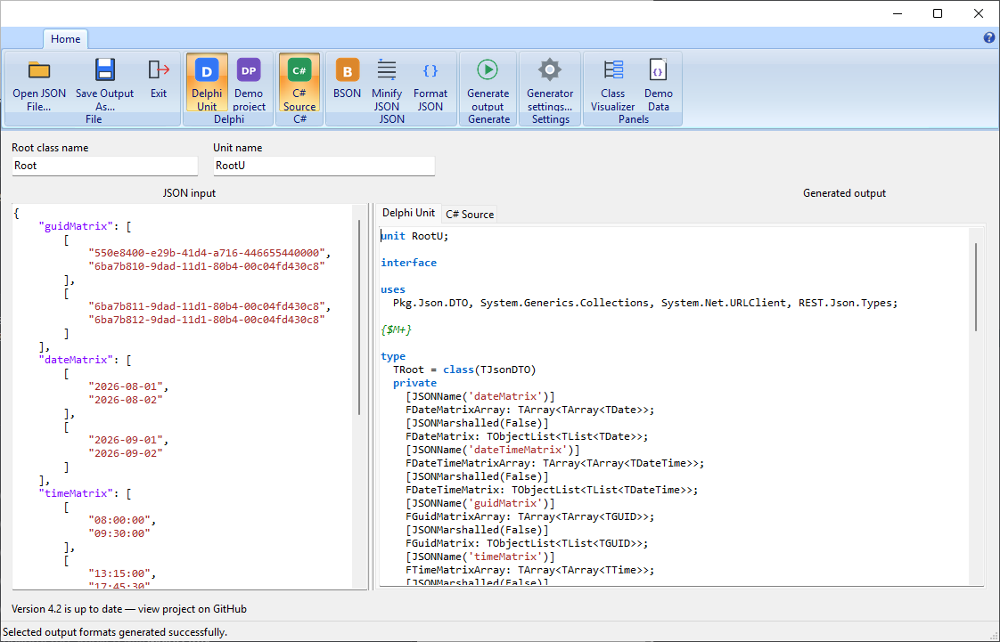

Delphi-JsonToDelphiClass
========================

## Fixes & Features: 14th August 2026 ##

### Features ###

* Renamed the historical `Pkg.*` units to the product-oriented
  `JsonToDelphi.*` namespace. The `Pkg` prefix originated from the initials of
  Petar Georgiev, who created the original project. Since the codebase has been
  substantially rewritten and expanded, its unit names now describe the
  product and their architectural role instead of an individual developer.
* Renamed the former `Lib` directory to `Runtime` because these units are
  dependencies of the generated Delphi code. Existing projects must update
  their unit references, for example from `Pkg.Json.DTO` to
  `JsonToDelphi.Runtime.DTO`.
* Added centralized type unification in
  `JsonToDelphi.Generator.Core.TypeUnification`. The model builder now handles
  numeric promotion, nullability, nested arrays and structural object merging,
  while validation remains responsible for JSON syntax and source locations.
* Added `TMatrix<T>` and `TObjectMatrix<T>` to the Delphi runtime for
  two-dimensional scalar and object arrays. Both types own their row lists,
  while `TObjectMatrix<T>` also owns the objects contained in each row.
* Added C# matrix generation through a self-contained `Matrix<T>` type derived
  from `List<List<T>>`. The type works directly with `System.Text.Json` without
  requiring a custom converter.
* Added type-unification and matrix demo files covering numeric promotion,
  nullable values, structural object merging, scalar matrices, object
  matrices, empty rows and jagged matrices.
* Simplified the generated demo project's JSON tree view from six legacy units
  to one shared VCL and FMX implementation while preserving the original JSON
  visualization features.

### Fixes ###

* Pasting JSON into the input editor no longer causes the application to become
  unresponsive due to recursive syntax highlighting.
* Fixed memory leaks in generated two-dimensional object arrays. Generated
  Delphi code now uses `TObjectMatrix<T>` so both row lists and their objects
  have explicit ownership.
* Added explicit Delphi JSON mapping for object matrices because Delphi's REST
  serializer cannot reliably deserialize `TArray<TArray<TObject>>` directly.
* Fixed C# string properties being emitted as `object` instead of `string`.
* Updated the demo-project template to include all required runtime units.
* Updated the end-to-end project unit search paths for the reorganized
  generator library.

## Fixes & Features: 12th August 2026 ##

### Features ###

* Added semantic detection and language-specific code generation for additional
  JSON string types:
  * ISO dates map to `TDate` in Delphi and `DateOnly` in C#.
  * ISO times map to `TTime` in Delphi and `TimeOnly` in C#.
  * GUID values map to `TGUID` in Delphi and `Guid` in C#.
  * URI values map to `TURI` in Delphi and `Uri` in C#.
* Added demo JSON files covering dates, times, GUIDs, URIs, semantic types and
  two-dimensional arrays.
* Added extensive automated test coverage for the shared generator model,
  validation, builder and both the Delphi and C# writers. The test suite now
  includes console, GUI, smoke and legacy-compatibility runners.
* Redesigned the Generator GUI main form and settings dialog.

  [](https://github.com/JensBorrisholt/Delphi-JsonToDelphiClass/blob/Development/Bugfixes/Images/Mainform_4.2.png)

* Added an integrated demo-data browser that can load the supplied JSON samples
  directly into the editor.
* Added a JSON class visualizer that refreshes as the input changes.
* Demo-project generation now supports selecting the target application
  framework and extracts the required runtime files from the embedded template.

### Requirements ###

The Generator GUI requires the `VCL.Ribbon` package. Install it from Delphi's
GetIt Package Manager before opening or compiling the project:

1. Open **Tools > GetIt Package Manager** in the Delphi IDE.
2. Search for **VCL Ribbon**.
3. Select the package and click **Install**.
4. Restart the Delphi IDE if requested, then reopen the project.

### Fixes ###

* Improved semantic type inference for scalar values and nested arrays while
  preserving the language-neutral generator model.
* Delphi output now includes `System.Net.URLClient` only when generated types
  require `TURI`.
* Date-only values now participate in the existing zero-date suppression logic.
* Updated the GUI layout, resizing and splitter handling for the redesigned
  main window.

## Fixes & Features: 05th August 2026 ##

### Features ###

* Added C# as a second generator backend.
  The same validated, language-neutral model can now be used to generate
  both Delphi and C# source code from the same JSON input.
  
* C# generation produces a complete `.cs` source file rather than isolated
  class declarations. Output includes the required `using` directives,
  `#nullable enable`, a file-scoped namespace and the generated types.

* Added a dedicated C# backend:
  * `TCSharpNaming` handles C# identifiers and reserved words.
  * `TCSharpWriter` maps the neutral model to C# types and emits source code.
  * `TCSharpSettings` contains C#-specific generator settings.

* Added C# generator settings for namespace, records, init-only properties,
  nullable value types, `JsonPropertyName` attributes and read-only list
  interfaces.
* Added C# syntax highlighting to the Generator GUI. The generated-code editor
  now switches syntax highlighting according to the selected output language.
* Reorganized the generator library into language-neutral and
  language-specific parts:

  ```text
  Generator LIB
  |-- Core
  |-- Delphi
  `-- CSharp
  ```

  `Core` contains the model builder, validation, errors and shared generator
  infrastructure. Delphi and C# naming, settings and source writers are kept
  in their respective language folders.

* Added `TGeneratorSettings` as the common settings base class. It inherits
  from `TJsonDTO` and provides shared `Load` and `Save` support through the
  existing `AsJson` serialization mechanism. `TDelphiSettings` and
  `TCSharpSettings` inherit from this base class while retaining only their
  language-specific options.

* Removed the legacy `JsonToDelphi.Runtime.Settings` generator settings implementation.
  Generator settings are now owned by the individual output-language
  backends.

### Fixes ###

* Normalized Delphi project source files to CRLF line endings for RAD Studio
  compatibility.

## Fixes & Features: 04th August 2026 ##

### Features ###

* The generator engine has been rebuilt from the ground up. This is not an
  incremental cleanup of the previous implementation: the old monolithic,
  stateful generation flow has been replaced by a compiler-style pipeline.
  JSON traversal, validation, type inference, naming, class reuse and Delphi
  source emission are no longer intertwined. Each stage now has an explicit
  input, output and responsibility:

  * `TJsonToDelphiGenerator` is the small public facade used by the GUI and
    other clients.
  * `TJsonSourceValidator` validates array shapes and element compatibility
    directly against the source text, retaining JSON paths and character
    ranges for useful error reporting.
  * `TJsonModelBuilder` traverses the parsed JSON and builds a language-neutral
    intermediate model of classes, fields, relationships and types. It does
    not create Delphi identifiers or make Delphi output decisions.
  * The type model is recursive. An array does not store a language-specific
    element declaration or a separate dimension counter; it contains another
    model type. A matrix is represented as `array -> array -> integer`.
  * JSON representation and semantic interpretation are stored separately.
    An ISO-8601 value is still recorded as a JSON string, while its semantic
    type can be date-time. Likewise, `true` and `false` are represented by one
    neutral boolean type rather than two generator-specific types.
  * Model fields retain their JSON name, JSON path, optional state, nullable
    state and source-location metadata. Model classes have a stable identity
    which is independent of the name produced by any output language.
  * `TGeneratorOptions` captures the settings for one generation, preventing
    mutable GUI settings from leaking into an active run.
  * `TDelphiNaming` and `TDelphiUnitWriter` now form the Delphi-specific
    backend. They create Delphi identifiers, escape reserved words, choose
    `TList<T>`/`TObjectList<T>`, add Delphi attributes and emit the unit without
    changing the neutral model.

  JSON is first validated and converted into a language-independent model;
  Delphi source is emitted only after that model is complete. All generation
  state belongs to a single generator instance and is cleared between parses.
  Class reuse is scoped to the model currently being generated, and the
  legacy naming and output rules are covered by dedicated compatibility tests.
  The GUI is now only a client of the generator instead of being part of its
  internal workflow. Type inference, validation and source emission can
  therefore be tested and evolved independently.

  This intermediate model also prepares the generator for additional output
  languages. A future C#, TypeScript, Kotlin or Swift backend can provide its
  own naming rules and type mappings while consuming the same validated model:

  ``text
  JSON source -> validation -> neutral model
                                  |-> Delphi writer
                                  |-> C# writer
                                  |-> TypeScript writer
                                  |-> other language writers
  ``

  Only the Delphi backend is included today; the architecture now makes other
  language backends an extension of the generator instead of another rewrite.
* Added support for homogeneous two-dimensional arrays of scalar values.
  Lists remain the public Delphi API; dynamic arrays are used only as the
  internal bridge required by Delphi's JSON serializer.

For example, this JSON:

```json
{
  "matrix": [
    [1, 2],
    [3, 4]
  ]
}
```

Generates a list-based property:

```pascal
property Matrix: TObjectList<TList<Integer>> read GetMatrix;
```

Rows must contain compatible values. A conflicting input such as
`[[1, 2], ["3", "4"]]` reports the failing JSON path instead of silently
choosing an incorrect Delphi type.

* Added a completely new Generator GUI written in VCL. The previous
  FireMonkey GUI has been replaced without removing the existing conversion
  features.
* Added rule-based syntax highlighting for both JSON input and generated
  Delphi source.
* Generator errors include the JSON path and source range. The corresponding
  text is selected in the JSON editor when generation fails.
* The refactored source tree is self-contained under `Refactored`; it does not
  depend on project units from the legacy directory structure.

### Fixes ###

* Mixed array element types now produce a precise error containing the
  expected type, actual type and JSON path.
* Generic list serialization resolves the matching published property through
  RTTI, avoiding the internal `TList<T>` implementation data that Delphi's
  default serializer would otherwise emit.

## Fixes & Features: 16th June 2024 ##
### Features ###
* JSON null property are now mapped to a string.

Eg this JSON
```json
{
    {
        "createdAt": null,
        "updatedAt": "2013-05-28T15:47:57.962Z",
        "username": "jacquelyn88"
    }
}
```

Generates the following DTO:
```pascal
  TItems = class
  private
    FCreatedAt: string;
    [SuppressZero]
    FUpdatedAt: TDateTime;
    FUsername: string;
  published
    property CreatedAt: string read FCreatedAt write FCreatedAt;
    property UpdatedAt: TDateTime read FUpdatedAt write FUpdatedAt;
    property Username: string read FUsername write FUsername;
  end;
```


## Fixes & Features: 04th February 2024 ##
### Features ###
* Added a Demo, using and authenticated endpoint
  

This demo illustrates how to authenticate a user to obtain a Bearer token.
Subsequently, this token is used to retrieve a list of products from an endpoint that requires authentication.

Thanks to [DummyJSON](https://dummyjson.com/) for providing this service.

## Fixes & Features: 01th February 2024 ##
### Features ###
* Added a Demo, getting Json from a WebAPI

  

  Thanks to [DummyJSON](https://dummyjson.com/) for providing this service.

## Fixes & Features: 19th January 2024 ##

### Features ###
* Upgrade to Delphi 12
* Added Clone function on TJsonDTO class

### Bugs: ###
* Unittest TestDateTime didn't pass under Delphi 12
* Added missing Reserved words

## Fixes & Features: 13th January 2024 ##
### Features ###
* Major code cleanup, especially naming
* Removed INDY from Upgrade chekker
* Forward classes are only generated if there are more than one thanks to [Daniel](https://github.com/DanielMorlova) for pointing this out

## Fixes & Features: 06th February 2022 ##

### Features ###
* More interceptors where published in a new repo: https://github.com/JensBorrisholt/Json-Interceptors
* Added the possibility to download JsonToDelphi.Runtime.DTO.pas from www.Json2Delphi.com


## Fixes & Features: 23th December 2021 ##

### Features ###
* Added ASP.NET interface: www.Json2Delphi.com
* Source code included

## Fixes & Features: 03th October 2021 ##

### Bugs: ###
* Wrong type detection. '2019-08-29' wasn't recognized as a Date, but a string
* All unittests didn't pass
* In the generator main form, the correct JSON wans't allways read from the MEMO
* In the generator main form, the JSON wasn't allways updated

### Features ###
* Upgraded to Delphi 11
* New property attribute : ```[SuppressZero]```
  Delphi doesn't support Nullable types, so use this attribute to strip TDateTime property where value is 0.

A Small example:
``` pascal
type
  TDateTimeDTO = class(TJsonDTO)
  private
    [SuppressZero]
    FSuppressDate: TDateTime;
    FNoSuppressDate: TDateTime;
  public
    property DateSuppress: TDateTime read FSuppressDate write FSuppressDate;
    property NoDateSuppress: TDateTime read FNoSuppressDate write FNoSuppressDate;
  end;
```
The above class will generate the following JSON, if both properties is 0

```json
  {
    "suppressDate":"",
    "noSuppressDate":"1899-12-30T00:00:00.000Z"
  }
```
NOTE: You can turn off this feature in the settings form

## Fixes & Features: 04th June 2021 ##

### Bugs: ###
* An error message occured when switching between the diffrent demo files
* Dates without timestamp wasn't recognized within  the RegEx
* Compile error in unit tests
* Updated elements in a list wasn't applied to the generated json.
* Issue #2 [Out of memory error and High CPU usage](https://github.com/JensBorrisholt/Delphi-JsonToDelphiClass/pull/2) - Thank You [MarkRSill](https://github.com/MarkRSill)

### Features ###
* Added unit tests for updating elements in lists.

## Fixes & Features: 26th Marts 2021 ##

### Bugs: ###
* The same class name could appear multiple times:

E.g this JSON generated faulty code:

```json
{
    "/": {
        "readonly": true
    },
    "\\": {
        "readonly": true
    }
} 
```

## Fixes & Features: 22th December 2020 ##

### Bugs: ###

### Features ###

* New main form. Completly rewritten. 
* Support for BSON
* Support for Minify JSON
* Support for multiblt output formats
* JSON are now minifyed before posted to the validator. Means support for larger JSONs to be validated. 
* Version 3.0 released.

## Fixes & Features: 11th December 2020 ##

### Bugs: ###

* "id": "01010101" faulty generated a TDateTime property not string. 
* Settings.AddJsonPropertyAttributes didn't generate a Property Attribute 

### Features ###

* JSON are now posted directly to the validator
* Better property name generator
* More unit tests

## Fixes & Features: 24th November 2020 ##

### Bugs: ###

### Features ###

* Possibility to change the postfix of ClassNames, via Settings Dialog. Default: DTO
* Settings Dialog rewritten to use LiveBindings
* Create a Demo Project, using *your* Json Data

## Fixes & Features: 22th November 2020 ##

### Bugs: ###
* Demo generator didn't allways generate valid code
* Stopped the generator from generating surplus classes. 

### Features ###
* Non object arrays are now mapped into a TList<T> instead of TArray<T>
* Added a settings dialog and settings class
* Properties in PascalCase (Setting)
* Allways use JsonName property annotation  (Setting)
* Support for objects with diffrents properties in an Array

Eg this JSON
```json
{
   "ArrayTest":[
      {
           "S1":"5102"
      },
      {
           "S2":"True"
      }
   ]
}
```

Generates the following DTO:
```pascal
  TArrayTestDTO = class
  private
    FS1: string;
    FS2: string;
  published
    property S1: string read FS1 write FS1;
    property S2: string read FS2 write FS2;
  end;
```


## Previous changes ##

* Only floating point numbers are mapped to Double
* Numbers are mapped to Integer or Int64 depending on their size
* Generated code restructored, and simplified
* Generated classes inheriteds from TJsonDTO
* Socurce Code restructored
* Parser logic seperated from GUI logic
* Fixed bug in the RegEx for recognizing an ISO8601 Date
* Serialization removed the "noise" of List<T> i.e. includes internal properties that did not exist in the original JSON string.
* Generated code uses TObjectList<T>
  
Generates Delphi or C# classes from a JSON string. Just like XML Data Binding, but for JSON.

## Main features ##

- Build entirely on the RTL (no external dependencies) so it's cross-platform;
- Accepts any valid JSON string, no matter how complex the object is;
- Visualizes the structure of the JSON objects in a treeview;
- Generates a complete Delphi unit or C# source file from the JSON string input;
- Handles reserved words and valid identifiers according to the selected output language;
- Support for JSON string that contains empty Array;
- Adds support code to automatically destroy complex sub types. So you don't have to manage subobject's lifetime manually;
- Uses TObjectList<T> to represent lists;
- Adds helper serialization/deserialization functions;
- Serialization and deserialization results in the same JSON structure!
- Automatically detects date/datetime parts and maps them to TDate/TDateTime (as long as dates are ISO8601 compliant);
- Maps floating point numbers to Double
- Maps Number to Integer or Int64 depending on the number
- Maps true/false values to Boolean;
- Supports JSON pretty print to format the input string;
- Simple and responsive GUI with selectable Delphi or C# output and language-specific syntax highlighting;
- Automatic check for update, based on ITask (Parallel Programming Library)!
- It's open source! You can find the source code and binary releases on GitHub.

* If the JSON array is empty the contained type is unknown. Unit generation works only with known and supported types.

*** The releases of JsonToDelphiClass (source and binaries) are public and reside on GitHub. The update unit uses GitHub's REST API to enumerate tags/releases.

Report any problems/suggestions using GitHub's facilities.
